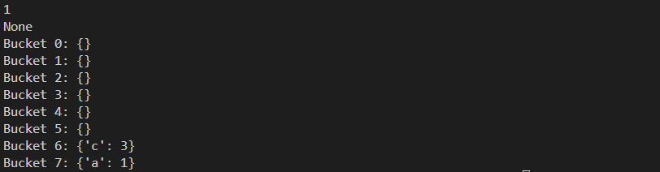
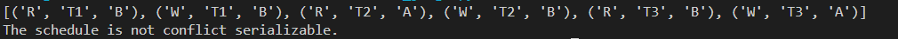
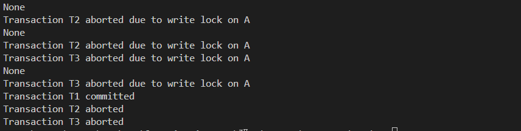
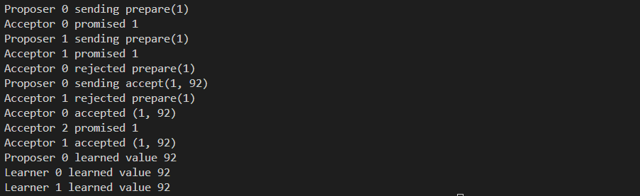

# 小作业二报告

## 程鹏宇 3124336012

### Task1 索引

完成线性散列索引的构建、检索、插入、删除的代码实现与测试。

#### Code

```python
class LinearHash:
    def __init__(self, initial_buckets=8):
        self.buckets = [{} for _ in range(initial_buckets)]
        self.bucket_count = initial_buckets
        self.split_index = 0
        self.threshold = 0.75

    def _hash(self, key, level=None):
        if level is None:
            level = self.bucket_count
        return hash(key) % level

    def _rehash(self):
        bucket_to_split = self.buckets[self.split_index]
        new_bucket = {}
        for key, value in bucket_to_split.items():
            new_index = self._hash(key, self.bucket_count * 2)
            if new_index < self.bucket_count:
                del self.buckets[new_index][key]
                self.buckets[new_index][key] = value
            else:
                new_bucket[key] = value
        self.buckets.append(new_bucket)
        self.bucket_count *= 2
        self.split_index += 1
        if self.split_index >= len(self.buckets):
            self.split_index = 0

    def insert(self, key, value):
        index = self._hash(key)
        bucket = self.buckets[index]
        if key in bucket:
            bucket[key] = value
        else:
            bucket[key] = value
            if sum(len(bucket) for bucket in self.buckets) / self.bucket_count > self.threshold:
                self._rehash()

    def retrieve(self, key):
        index = self._hash(key)
        bucket = self.buckets[index]
        return bucket.get(key, None)

    def delete(self, key):
        index = self._hash(key)
        bucket = self.buckets[index]
        if key in bucket:
            del bucket[key]

    def __str__(self):
        return '\n'.join(f'Bucket {i}: {bucket}' for i, bucket in enumerate(self.buckets))
```

这段代码主要功能包括向线性散列表中插入、检索和删除键值对。具体如下：

1. **`__init__`**:

   ​	初始化时创建指定数量的桶（默认8个），每个桶是一个字典。设置初始桶的数量、分裂索引和装填因子阈值。

2. **`_hash`**:

   ​	计算键的哈希值，根据当前桶的数量或指定的层级来确定哈希值。

3. **`_rehash`**:

   ​	当某个桶满时，选择当前分裂索引的桶进行分裂。将桶中的元素重新分配到新的桶中，更新桶数组和分裂索引。

4. **`insert`**:

   ​	插入键值对到相应的桶中。如果桶的平均负载超过阈值，则调用 `_rehash` 进行重哈希。

5. **`retrieve`**:

   ​	根据键查找并返回对应的值，如果不存在则返回 `None`。

6. **`delete`**:

   ​	根据键删除对应的键值对。

7. **`__str__`**:

   ​	返回所有桶的内容，方便调试和查看。

#### Test

```python
# 示例使用
if __name__ == '__main__':
    lh = LinearHash()
    lh.insert('a', 1)
    lh.insert('b', 2)
    lh.insert('c', 3)
    print(lh.retrieve('a'))  # 输出: 1
    lh.delete('b')
    print(lh.retrieve('b'))  # 输出: None
    print(lh)
```



### Task2-1 冲突可串行性判别算法

实现冲突可串行性判别算法

#### Code

```python
from collections import defaultdict, deque

def build_conflict_graph(schedule):
    conflict_graph = defaultdict(set)
    operations = []
    for operation in schedule:
        action, transaction, item = operation
        operations.append((action, transaction, item))
    last_operations = defaultdict(lambda: defaultdict(tuple))
    for idx, (action, transaction, item) in enumerate(operations):
        if action == 'W':
            if item in last_operations:
                for t, op_idx in last_operations[item].items():
                    if t != transaction:
                        conflict_graph[t].add(transaction)
                        conflict_graph[transaction].add(t)
            last_operations[item][transaction] = (action, idx)
        elif action == 'R':
            if item in last_operations:
                for t, (last_action, op_idx) in last_operations[item].items():
                    if t != transaction and last_action == 'W':
                        conflict_graph[t].add(transaction)
                        conflict_graph[transaction].add(t)
            last_operations[item][transaction] = (action, idx)

    return conflict_graph

def is_cyclic(conflict_graph):
    visited = set()
    recursion_stack = set()
    def dfs(node):
        visited.add(node)
        recursion_stack.add(node)
        for neighbor in conflict_graph[node]:
            if neighbor not in visited:
                if dfs(neighbor):
                    return True
            elif neighbor in recursion_stack:
                return True

        recursion_stack.remove(node)
        return False
    for node in conflict_graph:
        if node not in visited:
            if dfs(node):
                return True
    return False

def is_conflict_serializable(schedule):
    conflict_graph = build_conflict_graph(schedule)
    return not is_cyclic(conflict_graph)
```

这段代码用于检测数据库事务调度的冲突可串行化。具体功能如下：

1. **`build_conflict_graph(schedule)`**:

   ​	构建冲突图。解析调度中的每个操作，记录每个事务对每个数据项的最后一次操作，检测写-写冲突和读-写冲突，并构建冲突图。

2. **`is_cyclic(conflict_graph)`**:

   ​	检测冲突图中是否存在环。使用深度优先搜索（DFS）算法遍历图，检测是否存在环。

3. **`is_conflict_serializable(schedule)`**:

   ​	判断调度是否冲突可串行化。首先调用 `build_conflict_graph` 构建冲突图，然后调用 `is_cyclic` 检测冲突图中是否存在环。如果不存在环，则调度是冲突可串行化的。

#### Test

```python
if __name__ == '__main__':
    schedule = [
        ('R', 'T1', 'A'),
        ('W', 'T1', 'B'),
        ('R', 'T2', 'A'),
        ('W', 'T2', 'B'),
        ('R', 'T3', 'B'),
        ('W', 'T3', 'A')
    ]
    
    print(schedule)
    if is_conflict_serializable(schedule):
        print("The schedule is conflict serializable.")
    else:
        print("The schedule is not conflict serializable.")
```

通过分析可以得出，这个schedule是不冲突的，进行测试以后，输出如下，初步证明程序正确



### Task2-2 基于时间戳的并发控制算法

基于时间戳的并发控制算法

#### Code

```python
from collections import defaultdict

class TimestampBasedConcurrencyControl:
    def __init__(self):
        self.data_items = {}
        self.write_timestamps = {}
        self.read_locks = defaultdict(set)
        self.write_locks = {}
        self.transactions = {}
        self.next_timestamp = 0

    def start_transaction(self, transaction_id):
        self.transactions[transaction_id] = self.next_timestamp
        self.next_timestamp += 1

    def read(self, transaction_id, data_item):
        ts = self.transactions[transaction_id]
        if data_item in self.write_locks and self.write_locks[data_item] != transaction_id:
            print(f"Transaction {transaction_id} aborted due to write lock on {data_item}")
            return None
        if data_item in self.write_timestamps and self.write_timestamps[data_item] >= ts:
            print(f"Transaction {transaction_id} aborted due to write timestamp on {data_item}")
            return None
        self.read_locks[data_item].add(transaction_id)
        return self.data_items.get(data_item, None)

    def write(self, transaction_id, data_item, value):
        ts = self.transactions[transaction_id]
        if data_item in self.write_locks and self.write_locks[data_item] != transaction_id:
            print(f"Transaction {transaction_id} aborted due to write lock on {data_item}")
            return False
        if data_item in self.write_timestamps and self.write_timestamps[data_item] >= ts:
            print(f"Transaction {transaction_id} aborted due to write timestamp on {data_item}")
            return False
        if data_item in self.read_locks and any(t != transaction_id for t in self.read_locks[data_item]):
            print(f"Transaction {transaction_id} aborted due to read lock on {data_item}")
            return False
        self.write_locks[data_item] = transaction_id
        self.data_items[data_item] = value
        self.write_timestamps[data_item] = ts
        return True

    def commit(self, transaction_id):
        for data_item in list(self.read_locks.keys()):
            if transaction_id in self.read_locks[data_item]:
                self.read_locks[data_item].remove(transaction_id)
                if not self.read_locks[data_item]:
                    del self.read_locks[data_item]
        if transaction_id in self.write_locks.values():
            for data_item, tid in list(self.write_locks.items()):
                if tid == transaction_id:
                    del self.write_locks[data_item]
        del self.transactions[transaction_id]
        print(f"Transaction {transaction_id} committed")

    def abort(self, transaction_id):
        for data_item in list(self.read_locks.keys()):
            if transaction_id in self.read_locks[data_item]:
                self.read_locks[data_item].remove(transaction_id)
                if not self.read_locks[data_item]:
                    del self.read_locks[data_item]
        if transaction_id in self.write_locks.values():
            for data_item, tid in list(self.write_locks.items()):
                if tid == transaction_id:
                    del self.write_locks[data_item]
        del self.transactions[transaction_id]
        print(f"Transaction {transaction_id} aborted")
```

这段代码实现了一个基于时间戳的并发控制机制，用于管理事务对数据项的读写操作，主要功能如下

1. **`build_conflict_graph(schedule)`**

​	构建冲突图。解析调度中的每个操作，记录每个事务对每个数据项的最后一次操作，检测写-写冲突和读-写冲突，并构建冲突图。

2. **`is_cyclic(conflict_graph)`**

​	检测冲突图中是否存在环。使用深度优先搜索（DFS）算法遍历图，检测是否存在环。

3. **`is_conflict_serializable(schedule)`**

​	判断调度是否冲突可串行化。首先调用 `build_conflict_graph` 构建冲突图，然后调用 `is_cyclic` 检测冲突图中是否存在环。如果不存在环，则调度是冲突可串行化的。

#### Test

```python
if __name__ == '__main__':
    tcc = TimestampBasedConcurrencyControl()

    tcc.start_transaction('T1')
    tcc.start_transaction('T2')
    tcc.start_transaction('T3')

    print(tcc.read('T1', 'A'))
    tcc.write('T1', 'A', 10)
    print(tcc.read('T2', 'A')) 
    tcc.write('T2', 'A', 20)
    print(tcc.read('T3', 'A'))
    tcc.write('T3', 'A', 30)
    tcc.commit('T1')
    tcc.abort('T2')
    tcc.abort('T3')
```



### Task3 Paxos协议实现

####  Code

```python
import random
import threading
import time

class Proposer:
    def __init__(self, proposer_id, acceptors, learners):
        self.proposer_id = proposer_id
        self.acceptors = acceptors
        self.learners = learners
        self.n = 0
        self.value = None
        self.majority = len(acceptors) // 2 + 1

    def propose(self, value):
        self.value = value
        self.n += 1
        self.prepare()

    def prepare(self):
        print(f"Proposer {self.proposer_id} sending prepare({self.n})")
        responses = []
        for acceptor in self.acceptors:
            response = acceptor.receive_prepare(self.n)
            if response:
                responses.append(response)
            if len(responses) >= self.majority:
                break
        if len(responses) >= self.majority:
            self.accept(responses)

    def accept(self, responses):
        max_n = -1
        max_value = None
        for n, value in responses:
            if n > max_n:
                max_n = n
                max_value = value
        value = max_value if max_value is not None else self.value
        print(f"Proposer {self.proposer_id} sending accept({self.n}, {value})")
        responses = []
        for acceptor in self.acceptors:
            response = acceptor.receive_accept(self.n, value)
            if response:
                responses.append(response)
            if len(responses) >= self.majority:
                break
        if len(responses) >= self.majority:
            self.learn(value)

    def learn(self, value):
        print(f"Proposer {self.proposer_id} learned value {value}")
        for learner in self.learners:
            learner.learn(value)

class Acceptor:
    def __init__(self, acceptor_id):
        self.acceptor_id = acceptor_id
        self.promised_n = -1
        self.accepted_n = -1
        self.accepted_value = None

    def receive_prepare(self, n):
        if n > self.promised_n:
            self.promised_n = n
            print(f"Acceptor {self.acceptor_id} promised {n}")
            return (self.accepted_n, self.accepted_value)
        print(f"Acceptor {self.acceptor_id} rejected prepare({n})")
        return None

    def receive_accept(self, n, value):
        if n >= self.promised_n:
            self.accepted_n = n
            self.accepted_value = value
            print(f"Acceptor {self.acceptor_id} accepted ({n}, {value})")
            return True
        print(f"Acceptor {self.acceptor_id} rejected accept({n}, {value})")
        return False

class Learner:
    def __init__(self, learner_id):
        self.learner_id = learner_id

    def learn(self, value):
        print(f"Learner {self.learner_id} learned value {value}")
```

这段代码实现了一个Paxos算法，具体模块介绍如下

1. **`__init__`**:

   ​	初始化提案者的ID、接受者列表、学习者列表、提案编号 `n` 和提案值 `value`。计算多数接受者的数量 `majority`。

2. **`propose`**:

   ​	设置提案值 `value`、增加提案编号 `n`、调用 `prepare` 方法开始准备阶段。

3. **`prepare`**:

   ​	发送准备请求 `prepare(n)` 给所有接受者，收集接受者的响应，直到达到多数。如果收集到多数响应，调用 `accept` 方法进入接受阶段。

4. **`accept`**:

   ​	从响应中找到最大的提案编号 `max_n` 和对应的值 `max_value`。如果 `max_value` 存在，使用 `max_value`；否则使用当前提案值 `value`。发送接受请求 `accept(n, value)` 给所有接受者。收集接受者的响应，直到达到多数。如果收集到多数响应，调用 `learn` 方法通知学习者。

5. **`learn`**:

   ​	打印提案者学习到的值并通知所有学习者学习该值。

#### Test

```python
if __name__ == '__main__':
    acceptors = [Acceptor(i) for i in range(3)]
    learners = [Learner(i) for i in range(2)]
    proposers = [Proposer(i, acceptors, learners) for i in range(2)]
    threads = []
    for proposer in proposers:
        thread = threading.Thread(target=proposer.propose, args=(random.randint(1, 100),))
        threads.append(thread)
        thread.start()
    for thread in threads:
        thread.join()
```

